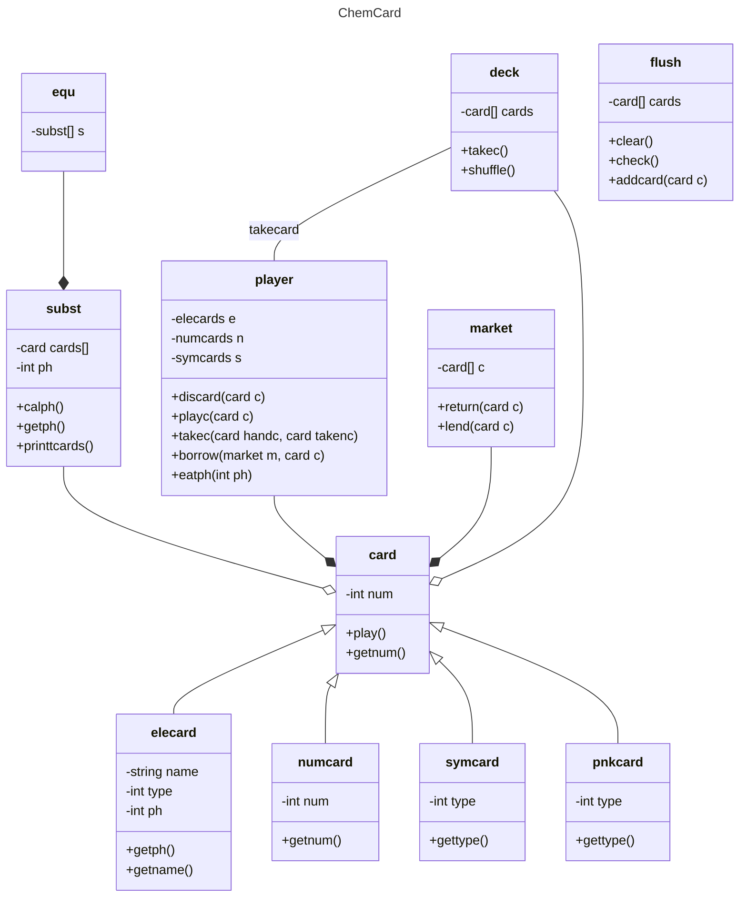

# ChemCard
a game of Chemistry Card

## class diagram

```mermaid
---
title: ChemCard
---

classDiagram
card <|-- elecard
card <|-- numcard
card <|-- symcard
card <|-- pnkcard
subst --o card
equ --* subst

player --* card
market --* card
class card{
    -int num
    +play()
    +getnum()
}

class elecard{ 
    -string name
    -int type
    -int ph
    
    +getph()
    +getname()
}

class symcard{
    -int type
    
    +gettype()
    
}

class numcard{
    -int num
    
    +getnum()
}

class player{
    -elecards e
    -numcards n
    -symcards s
    
    +discard(card c)
    +playc(card c)
    +takec(card handc, card takenc)
    +borrow(market m, card c)
    +eatph(int ph)
}

class deck{
    -card[] cards
    +takec()
    +shuffle()
}

class market{
    -card[] c
    
    +return(card c)
    +lend(card c)
}

class subst{
    -card cards[]
    -int ph
    +calph()
    +getph()
    +printtcards()
    
}

class pnkcard{
  -int type
  +gettype()
}

class flush{
  -card[] cards
  +clear()
  +check()  
  +addcard(card c)
}

class equ{
  -subst[] s
  
}

deck -- player : takecard
deck --o card

```